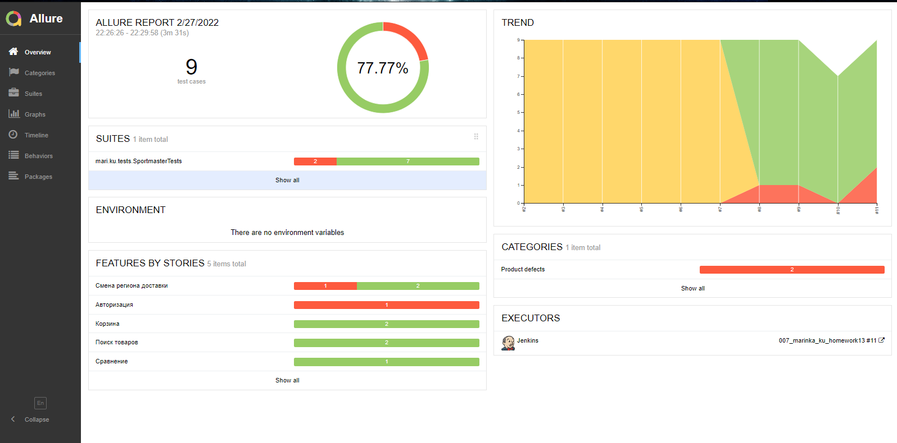
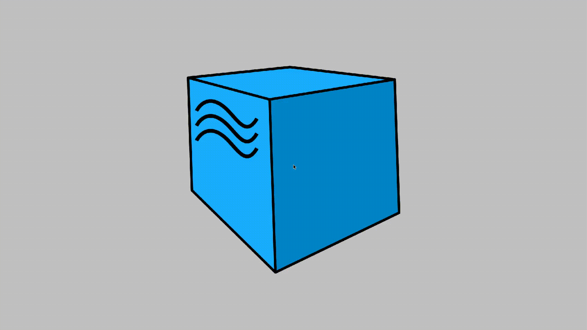
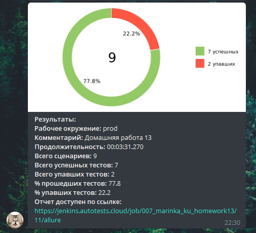

# Автоматизация тестирования сайта Sportmaster

## :clipboard: Содержание

>  - [Что было автоматизировано?](#Что было автоматизировано?)
>
>  - [Какой технологический стек использовался?](#hammer_and_wrench)
>
>  - [Как можно запустить тесты?](#arrow_forward)
>
>  - [Где можно увидеть отчёт о прогоне тестов?](#heavy_check_mark)
>
>  - [Имеются ли уведомления о результатах прогона тестов?](#airplane)


## :pushpin: <a name="Что было автоматизировано?"></a>

**В рамках проекта автоматизирован следующий набор UI проверок на сайте Sportmaster:**

>  1. *Проверка выбора региона доставки*
>  2. *Проверка работы поиска товаров*
>  3. *Проверка добавления и удаления товаров из сравнения*
>  4. *Проверка добавления и удаления товаров из корзины*
>  5. *Проверка формирования ошибки 'Некорректный код подтверждения*
>  6. *Проверка формирования ошибки 'Неверный код' на корзине*

## :hammer_and_wrench: Какой технологический стек использовался?

<p align="center">


</p>


## :arrow_forward: Как можно запустить тесты?
>  Тесты можно запустить локально в терминале <code>Intelij IDEA</code> или удалённо через <code>Jenkins</code>.

### :green_circle: Локальный запуск тестов

>  - Для запуска всех тестов использовать команду:
>  ```
>  gradle clean test
>  ```

>  - Для запуска только положительных тестов использовать команду:
>  ```
>  gradle clean test_positive
>  ```

>  - Для запуска только негативных тестов использовать команду:
>  ```
>  gradle clean test_negative
>  ```

### :orange_circle:	 Удаленный запуск тестов

>  При удалённом запуске через Jenkins используется следующая команда запуска:
>  ```
>  clean
>  ${TASK}
>  -Dbrowser=${BROWSER}
>  -DbrowserVersion=${VERSION}
>  -DbrowserSize=${SIZE}
>  ```

>  Параметры сборки:
>  - <code>TASK</code> — таска для запуска необходимых тестов (по умолчанию - <code>test</code>);
>  - <code>BROWSER</code> — браузер, в котором будут выполняться тесты (по умолчанию - <code>chrome</code>);
>  - <code>VERSION</code> — версия браузера, в котором будут выполняться тесты (по умолчанию - <code>91.0</code>);
>  - <code>SIZE</code> — размер окна браузера, в котором будут выполняться тесты (по умолчанию - <code>1280x1024</code>).

> Ссылка на job в Jenkins:
> [007_marinka_ku_homework13](https://jenkins.autotests.cloud/job/007_marinka_ku_homework13/)

## :heavy_check_mark: Где можно увидеть отчёт о прогоне тестов?

>  Для предоставления отчётной информации используется <code>Allure</code>.
>  После выполнения каждой сборки формируется отчёт, в котором можно увидеть перечень прошедших и упавших тестов, графики и диаграммы.
>  К каждому тесту прилагается скриншот, логи, видео прохождения теста.
>  Дополнительно выполнена интеграция с <code>Allure TestOps</code>, там так же можно просматривать отчёт.

>  Пример отчёта в Allure:
>  <p align="center">
>  
>  </p>

>  Пример видео в Allure:
>  <p align="center">
>  
>  </p>

## :airplane: Имеются ли уведомления о результатах прогона тестов?

>  Для уведомления заинтересованных лиц используется специально настроенный бот в <code>Telegram</code>.
>  После выполнения каждой сборки формируется и отправляется в группы, где состоит бот, сообщение с отчётом о прогоне.

>  Пример такого сообщения:
>  <p align="center">
>  
>  </p>

